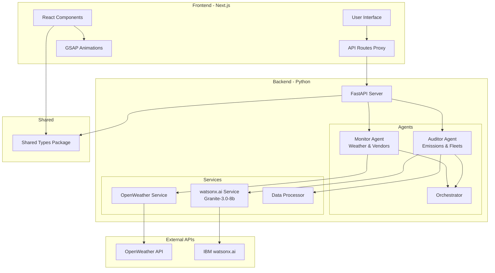

# Eco-Shift Monorepo Architecture

## 📋 Executive Summary

This document outlines the monorepo architecture for **Eco-Shift**, a multi-agent supply chain orchestrator designed for the IBM Bob Hackathon. The structure prioritizes rapid development while maintaining scalability and clean separation of concerns.

## 🏗️ Complete Directory Structure

```
eco-shift/
├── apps/
│   ├── frontend/                    # Next.js application
│   │   ├── src/
│   │   │   ├── app/                # Next.js 13+ app directory
│   │   │   │   ├── api/            # API routes (proxy to backend)
│   │   │   │   ├── dashboard/      # Dashboard pages
│   │   │   │   ├── layout.tsx
│   │   │   │   └── page.tsx
│   │   │   ├── components/         # React components
│   │   │   │   ├── ui/             # Reusable UI components
│   │   │   │   ├── dashboard/      # Dashboard-specific components
│   │   │   │   ├── charts/         # Data visualization components
│   │   │   │   └── animations/     # GSAP animation components
│   │   │   ├── lib/                # Frontend utilities
│   │   │   │   ├── api-client.ts   # Backend API client
│   │   │   │   ├── animations.ts   # GSAP utilities
│   │   │   │   └── utils.ts
│   │   │   ├── hooks/              # Custom React hooks
│   │   │   ├── styles/             # Global styles
│   │   │   └── types/              # Frontend-specific types
│   │   ├── public/                 # Static assets
│   │   ├── tests/                  # Frontend tests
│   │   ├── next.config.js
│   │   ├── tailwind.config.js
│   │   ├── tsconfig.json
│   │   └── package.json
│   │
│   └── backend/                     # Python backend application
│       ├── src/
│       │   ├── agents/             # BeeAI agent implementations
│       │   │   ├── __init__.py
│       │   │   ├── base_agent.py   # Base agent class
│       │   │   ├── monitor/        # Agent A: The Monitor
│       │   │   │   ├── __init__.py
│       │   │   │   ├── agent.py    # Monitor agent implementation
│       │   │   │   ├── weather_service.py
│       │   │   │   ├── vendor_manager.py
│       │   │   │   └── config.py
│       │   │   ├── auditor/        # Agent B: The Auditor
│       │   │   │   ├── __init__.py
│       │   │   │   ├── agent.py    # Auditor agent implementation
│       │   │   │   ├── emissions_calculator.py
│       │   │   │   ├── fleet_prioritizer.py
│       │   │   │   └── config.py
│       │   │   └── orchestrator/   # Agent coordination
│       │   │       ├── __init__.py
│       │   │       ├── coordinator.py
│       │   │       └── message_bus.py
│       │   ├── api/                # FastAPI/Flask REST API
│       │   │   ├── __init__.py
│       │   │   ├── main.py         # API entry point
│       │   │   ├── routes/
│       │   │   │   ├── __init__.py
│       │   │   │   ├── agents.py   # Agent status/control endpoints
│       │   │   │   ├── emissions.py # Emissions data endpoints
│       │   │   │   ├── vendors.py  # Vendor management endpoints
│       │   │   │   └── weather.py  # Weather data endpoints
│       │   │   ├── middleware/
│       │   │   │   ├── __init__.py
│       │   │   │   ├── cors.py
│       │   │   │   └── auth.py
│       │   │   └── schemas/        # Pydantic models
│       │   │       ├── __init__.py
│       │   │       ├── agent.py
│       │   │       ├── emissions.py
│       │   │       └── vendor.py
│       │   ├── services/           # Business logic layer
│       │   │   ├── __init__.py
│       │   │   ├── watsonx_service.py  # IBM watsonx.ai integration
│       │   │   ├── openweather_service.py
│       │   │   └── data_processor.py
│       │   ├── models/             # Data models
│       │   │   ├── __init__.py
│       │   │   ├── vendor.py
│       │   │   ├── emission.py
│       │   │   └── weather.py
│       │   ├── utils/              # Backend utilities
│       │   │   ├── __init__.py
│       │   │   ├── logger.py
│       │   │   ├── config.py
│       │   │   └── validators.py
│       │   └── db/                 # Database layer (if needed)
│       │       ├── __init__.py
│       │       └── connection.py
│       ├── tests/                  # Backend tests
│       │   ├── unit/
│       │   ├── integration/
│       │   └── conftest.py
│       ├── requirements.txt
│       ├── requirements-dev.txt
│       ├── pyproject.toml
│       └── README.md
│
├── packages/                        # Shared packages
│   ├── types/                      # Shared TypeScript types
│   │   ├── src/
│   │   │   ├── index.ts
│   │   │   ├── agent.types.ts
│   │   │   ├── emissions.types.ts
│   │   │   ├── vendor.types.ts
│   │   │   └── api.types.ts
│   │   ├── package.json
│   │   └── tsconfig.json
│   │
│   └── config/                     # Shared configuration
│       ├── eslint-config/          # Shared ESLint config
│       │   ├── index.js
│       │   └── package.json
│       └── tsconfig/               # Shared TypeScript configs
│           ├── base.json
│           ├── nextjs.json
│           └── package.json
│
├── scripts/                         # Development and deployment scripts
│   ├── setup.sh                    # Initial setup script
│   ├── dev.sh                      # Start all services in dev mode
│   ├── build.sh                    # Build all applications
│   ├── test.sh                     # Run all tests
│   └── deploy.sh                   # Deployment script
│
├── docs/                           # Documentation
│   ├── ARCHITECTURE.md             # This file
│   ├── API.md                      # API documentation
│   ├── AGENTS.md                   # Agent behavior documentation
│   ├── DEPLOYMENT.md               # Deployment guide
│   └── DEVELOPMENT.md              # Development guide
│
├── config/                         # Root-level configuration
│   ├── .env.example                # Environment variables template
│   ├── docker-compose.yml          # Docker composition (optional)
│   └── nginx.conf                  # Nginx config (if needed)
│
├── .github/                        # GitHub configuration
│   └── workflows/
│       ├── ci.yml                  # CI pipeline
│       └── deploy.yml              # Deployment pipeline
│
├── .gitignore
├── README.md
├── AGENTS.md                       # Agent guidance file
├── package.json                    # Root package.json (workspace config)
├── pnpm-workspace.yaml             # PNPM workspace config
└── turbo.json                      # Turborepo config (optional)
```

## 🎯 Architectural Rationale

### 1. **Monorepo Structure Choice**

**Decision:** Apps-based monorepo with shared packages

**Rationale:**
- **Clear Separation:** [`apps/`](apps/) directory clearly separates deployable applications
- **Code Reuse:** [`packages/`](packages/) enables sharing types and configs between frontend/backend
- **Independent Deployment:** Each app can be deployed independently
- **Scalability:** Easy to add new agents or services without restructuring
- **Hackathon-Friendly:** Simple mental model, easy for team members to navigate

### 2. **Frontend Structure ([`apps/frontend/`](apps/frontend/))**

**Technology:** Next.js 13+ with App Router

**Key Decisions:**
- **App Router:** Modern Next.js structure for better performance and DX
- **Component Organization:** Separated by function (ui, dashboard, charts, animations)
- **API Routes as Proxy:** Next.js API routes proxy to Python backend for security
- **GSAP Integration:** Dedicated [`animations/`](apps/frontend/src/components/animations/) directory for GSAP components
- **Type Safety:** Local types + shared types from [`packages/types/`](packages/types/)

**Benefits:**
- Fast development with Next.js hot reload
- Built-in API routes for backend communication
- Tailwind CSS for rapid styling
- GSAP for smooth, professional animations

### 3. **Backend Structure ([`apps/backend/`](apps/backend/))**

**Technology:** Python with BeeAI framework + FastAPI

**Key Decisions:**

#### **Agent Organization ([`src/agents/`](apps/backend/src/agents/))**
```
agents/
├── base_agent.py          # Abstract base class for all agents
├── monitor/               # Agent A: Weather monitoring & vendor management
├── auditor/               # Agent B: Emissions calculation & fleet prioritization
└── orchestrator/          # Coordinates agent communication
```

**Agent Design Principles:**
- **Modularity:** Each agent is self-contained with its own config
- **Extensibility:** Base agent class makes adding new agents trivial
- **Separation of Concerns:** Each agent has dedicated service modules
- **BeeAI Integration:** Agents use BeeAI framework for AI capabilities
- **Message Bus:** Orchestrator enables inter-agent communication

#### **API Layer ([`src/api/`](apps/backend/src/api/))**
- **FastAPI:** Modern, fast, with automatic OpenAPI docs
- **Route Organization:** Grouped by domain (agents, emissions, vendors, weather)
- **Pydantic Schemas:** Type-safe request/response validation
- **Middleware:** CORS, auth, logging centralized

#### **Services Layer ([`src/services/`](apps/backend/src/services/))**
- **watsonx_service.py:** IBM watsonx.ai Granite-3.0-8b integration
- **openweather_service.py:** OpenWeather API client
- **data_processor.py:** Business logic for data transformation

**Benefits:**
- Clean architecture with clear layers
- Easy to test each component independently
- Scalable for adding more agents
- Type-safe with Pydantic models

### 4. **Shared Packages ([`packages/`](packages/))**

#### **Types Package ([`packages/types/`](packages/types/))**
**Purpose:** Single source of truth for data structures

**Contents:**
- [`agent.types.ts`](packages/types/src/agent.types.ts): Agent status, configuration types
- [`emissions.types.ts`](packages/types/src/emissions.types.ts): Scope 3 emissions data structures
- [`vendor.types.ts`](packages/types/src/vendor.types.ts): Vendor and fleet information
- [`api.types.ts`](packages/types/src/api.types.ts): API request/response types

**Benefits:**
- Frontend and backend share same type definitions
- Reduces bugs from type mismatches
- Single place to update when data structures change

#### **Config Package ([`packages/config/`](packages/config/))**
**Purpose:** Shared linting and TypeScript configurations

**Benefits:**
- Consistent code style across all TypeScript code
- DRY principle for configuration
- Easy to update standards project-wide

### 5. **Configuration Management**

#### **Environment Variables Strategy**

```
config/
└── .env.example          # Template with all required variables

apps/frontend/
└── .env.local            # Frontend-specific variables

apps/backend/
└── .env                  # Backend-specific variables
```

**Key Variables:**
```bash
# Backend (.env)
WATSONX_API_KEY=your_key
WATSONX_PROJECT_ID=your_project
OPENWEATHER_API_KEY=your_key
DATABASE_URL=postgresql://...
CORS_ORIGINS=http://localhost:3000

# Frontend (.env.local)
NEXT_PUBLIC_API_URL=http://localhost:8000
NEXT_PUBLIC_ENABLE_ANALYTICS=false
```

**Benefits:**
- Clear separation of frontend/backend secrets
- Template file prevents missing variables
- NEXT_PUBLIC_ prefix for client-safe variables

### 6. **Agent Architecture Deep Dive**

#### **Agent A: The Monitor**

**Location:** [`apps/backend/src/agents/monitor/`](apps/backend/src/agents/monitor/)

**Responsibilities:**
1. Poll OpenWeather API for weather data
2. Manage vendor lists and availability
3. Trigger alerts based on weather conditions
4. Communicate with Auditor agent

**Key Files:**
- [`agent.py`](apps/backend/src/agents/monitor/agent.py): Main agent logic using BeeAI
- [`weather_service.py`](apps/backend/src/agents/monitor/weather_service.py): OpenWeather API integration
- [`vendor_manager.py`](apps/backend/src/agents/monitor/vendor_manager.py): Vendor CRUD operations
- [`config.py`](apps/backend/src/agents/monitor/config.py): Agent-specific configuration

**Data Flow:**
```
OpenWeather API → weather_service.py → agent.py → orchestrator → Frontend
                                      ↓
                                vendor_manager.py → Database
```

#### **Agent B: The Auditor**

**Location:** [`apps/backend/src/agents/auditor/`](apps/backend/src/agents/auditor/)

**Responsibilities:**
1. Calculate Scope 3 emissions for supply chain
2. Prioritize hydrogen-fueled fleets
3. Generate sustainability reports
4. Provide recommendations via watsonx.ai

**Key Files:**
- [`agent.py`](apps/backend/src/agents/auditor/agent.py): Main agent logic using BeeAI
- [`emissions_calculator.py`](apps/backend/src/agents/auditor/emissions_calculator.py): Scope 3 calculations
- [`fleet_prioritizer.py`](apps/backend/src/agents/auditor/fleet_prioritizer.py): Fleet ranking logic
- [`config.py`](apps/backend/src/agents/auditor/config.py): Agent-specific configuration

**Data Flow:**
```
Vendor Data → emissions_calculator.py → agent.py → watsonx.ai (Granite-3.0-8b)
                                       ↓
                              fleet_prioritizer.py → Recommendations → Frontend
```

#### **Agent Orchestrator**

**Location:** [`apps/backend/src/agents/orchestrator/`](apps/backend/src/agents/orchestrator/)

**Purpose:** Coordinate communication between agents

**Key Components:**
- [`coordinator.py`](apps/backend/src/agents/orchestrator/coordinator.py): Manages agent lifecycle
- [`message_bus.py`](apps/backend/src/agents/orchestrator/message_bus.py): Inter-agent messaging

**Communication Pattern:**
```
Monitor Agent → Message Bus → Auditor Agent
      ↓                            ↓
  Weather Data              Emissions Analysis
      ↓                            ↓
      └──────→ Orchestrator ←──────┘
                    ↓
              API Layer → Frontend
```

### 7. **API Integration Points**

#### **Frontend → Backend Communication**

**Architecture:** Next.js API Routes as Proxy

```typescript
// apps/frontend/src/app/api/agents/route.ts
export async function GET() {
  const response = await fetch(`${process.env.BACKEND_URL}/api/agents`);
  return Response.json(await response.json());
}
```

**Benefits:**
- Hides backend URL from client
- Enables server-side authentication
- CORS handled automatically
- Can add caching/rate limiting

#### **Backend API Endpoints**

**Base URL:** `http://localhost:8000/api`

**Key Endpoints:**

```python
# Agent Management
GET    /api/agents                    # List all agents and status
GET    /api/agents/{agent_id}         # Get specific agent details
POST   /api/agents/{agent_id}/start   # Start an agent
POST   /api/agents/{agent_id}/stop    # Stop an agent

# Weather Data (Monitor Agent)
GET    /api/weather/current           # Current weather data
GET    /api/weather/forecast          # Weather forecast
GET    /api/weather/alerts            # Weather alerts

# Vendor Management (Monitor Agent)
GET    /api/vendors                   # List all vendors
POST   /api/vendors                   # Add new vendor
PUT    /api/vendors/{vendor_id}       # Update vendor
DELETE /api/vendors/{vendor_id}       # Remove vendor

# Emissions Data (Auditor Agent)
GET    /api/emissions/scope3          # Scope 3 emissions data
GET    /api/emissions/analysis        # Emissions analysis
POST   /api/emissions/calculate       # Calculate emissions for route

# Fleet Management (Auditor Agent)
GET    /api/fleets                    # List all fleets
GET    /api/fleets/prioritized        # Hydrogen-prioritized fleets
GET    /api/fleets/{fleet_id}/score   # Get fleet sustainability score
```

#### **WebSocket Support (Optional for Real-time Updates)**

```python
# apps/backend/src/api/websocket.py
@app.websocket("/ws/agents")
async def agent_updates(websocket: WebSocket):
    # Stream agent status updates to frontend
    pass
```

### 8. **Testing Strategy**

#### **Frontend Tests ([`apps/frontend/tests/`](apps/frontend/tests/))**
```
tests/
├── unit/                  # Component unit tests
│   ├── components/
│   └── hooks/
├── integration/           # API integration tests
└── e2e/                   # End-to-end tests (Playwright)
```

**Tools:** Jest, React Testing Library, Playwright

#### **Backend Tests ([`apps/backend/tests/`](apps/backend/tests/))**
```
tests/
├── unit/                  # Unit tests for services/agents
│   ├── test_agents.py
│   ├── test_services.py
│   └── test_utils.py
├── integration/           # API integration tests
│   ├── test_api_routes.py
│   └── test_agent_communication.py
└── conftest.py            # Pytest fixtures
```

**Tools:** pytest, pytest-asyncio, httpx (for API testing)

### 9. **Development Workflow**

#### **Quick Start Commands**

```bash
# Initial setup
./scripts/setup.sh

# Start all services in development mode
./scripts/dev.sh

# Run tests
./scripts/test.sh

# Build for production
./scripts/build.sh
```

#### **Individual Service Commands**

```bash
# Frontend only
cd apps/frontend
npm run dev              # Start dev server on :3000

# Backend only
cd apps/backend
python -m uvicorn src.api.main:app --reload  # Start API on :8000
```

### 10. **Scalability Considerations**

#### **Adding New Agents**

**Process:**
1. Create new directory in [`apps/backend/src/agents/`](apps/backend/src/agents/)
2. Extend [`base_agent.py`](apps/backend/src/agents/base_agent.py)
3. Register with orchestrator
4. Add API routes if needed
5. Update frontend to display agent status

**Example Structure:**
```python
# apps/backend/src/agents/optimizer/agent.py
from agents.base_agent import BaseAgent

class OptimizerAgent(BaseAgent):
    def __init__(self):
        super().__init__(name="optimizer")
    
    async def execute(self):
        # Agent logic here
        pass
```

#### **Future Agent Ideas**
- **Route Optimizer:** Optimizes delivery routes based on emissions
- **Demand Forecaster:** Predicts supply chain demand using AI
- **Risk Assessor:** Evaluates supply chain risks
- **Cost Analyzer:** Analyzes cost vs. sustainability tradeoffs

### 11. **Technology Integration Details**

#### **IBM watsonx.ai Integration**

**Location:** [`apps/backend/src/services/watsonx_service.py`](apps/backend/src/services/watsonx_service.py)

```python
from ibm_watsonx_ai import Credentials, APIClient
from ibm_watsonx_ai.foundation_models import ModelInference

class WatsonXService:
    def __init__(self):
        self.credentials = Credentials(
            api_key=os.getenv("WATSONX_API_KEY"),
            url="https://us-south.ml.cloud.ibm.com"
        )
        self.client = APIClient(self.credentials)
        self.model = ModelInference(
            model_id="ibm/granite-3-8b-instruct",
            credentials=self.credentials,
            project_id=os.getenv("WATSONX_PROJECT_ID")
        )
    
    async def generate_recommendations(self, emissions_data):
        prompt = f"Analyze emissions data and provide recommendations: {emissions_data}"
        response = self.model.generate(prompt=prompt)
        return response
```

#### **BeeAI Framework Integration**

**Location:** [`apps/backend/src/agents/base_agent.py`](apps/backend/src/agents/base_agent.py)

```python
from bee_agent import BeeAgent, Tool

class BaseAgent(BeeAgent):
    def __init__(self, name: str):
        super().__init__(name=name)
        self.tools = self._register_tools()
    
    def _register_tools(self) -> list[Tool]:
        # Register tools for the agent
        return []
    
    async def execute(self):
        # Override in subclasses
        raise NotImplementedError
```

#### **GSAP Animation Setup**

**Location:** [`apps/frontend/src/lib/animations.ts`](apps/frontend/src/lib/animations.ts)

```typescript
import gsap from 'gsap';
import { ScrollTrigger } from 'gsap/ScrollTrigger';

gsap.registerPlugin(ScrollTrigger);

export const fadeInUp = (element: HTMLElement) => {
  gsap.from(element, {
    y: 50,
    opacity: 0,
    duration: 0.8,
    ease: 'power3.out'
  });
};

export const animateEmissionsChart = (data: number[]) => {
  // Custom GSAP animations for charts
};
```

### 12. **Hackathon-Specific Optimizations**

#### **Rapid Development Priorities**

1. **Use Mock Data Initially**
   - Create [`apps/backend/src/utils/mock_data.py`](apps/backend/src/utils/mock_data.py)
   - Allows frontend development without waiting for API integrations

2. **Parallel Development**
   - Frontend team: Work on UI with mock data
   - Backend team: Implement agents and API
   - Integration: Last 12 hours

3. **Pre-built Components**
   - Use shadcn/ui for rapid UI development
   - Tailwind CSS for quick styling
   - Chart.js or Recharts for data visualization

4. **Simplified Authentication**
   - Skip complex auth for hackathon
   - Use simple API key if needed

5. **Docker Compose for Easy Setup**
   ```yaml
   # config/docker-compose.yml
   services:
     frontend:
       build: ./apps/frontend
       ports:
         - "3000:3000"
     backend:
       build: ./apps/backend
       ports:
         - "8000:8000"
       environment:
         - WATSONX_API_KEY=${WATSONX_API_KEY}
   ```

### 13. **Documentation Strategy**

#### **Essential Documentation Files**

1. **[`docs/API.md`](docs/API.md)**: Complete API documentation with examples
2. **[`docs/AGENTS.md`](docs/AGENTS.md)**: Agent behavior and communication patterns
3. **[`docs/DEVELOPMENT.md`](docs/DEVELOPMENT.md)**: Setup and development guide
4. **[`docs/DEPLOYMENT.md`](docs/DEPLOYMENT.md)**: Deployment instructions

#### **Code Documentation**

- **Python:** Docstrings for all classes and functions
- **TypeScript:** JSDoc comments for complex functions
- **README.md:** In each major directory explaining its purpose

## 🚀 Implementation Timeline (48 Hours)

### **Hour 0-4: Setup & Foundation**
- [ ] Initialize monorepo structure
- [ ] Set up Next.js frontend
- [ ] Set up Python backend with FastAPI
- [ ] Configure shared types package
- [ ] Set up development scripts

### **Hour 4-12: Core Agent Development**
- [ ] Implement Monitor Agent (Agent A)
- [ ] Implement Auditor Agent (Agent B)
- [ ] Set up agent orchestrator
- [ ] Integrate OpenWeather API
- [ ] Integrate IBM watsonx.ai

### **Hour 12-24: API & Integration**
- [ ] Build FastAPI endpoints
- [ ] Implement frontend API client
- [ ] Connect agents to API
- [ ] Test agent communication
- [ ] Set up WebSocket for real-time updates

### **Hour 24-36: Frontend Development**
- [ ] Build dashboard UI
- [ ] Implement data visualization
- [ ] Add GSAP animations
- [ ] Connect to backend API
- [ ] Responsive design with Tailwind

### **Hour 36-44: Testing & Polish**
- [ ] Integration testing
- [ ] Bug fixes
- [ ] Performance optimization
- [ ] Documentation
- [ ] Demo preparation

### **Hour 44-48: Final Touches**
- [ ] Final testing
- [ ] Deployment
- [ ] Demo rehearsal
- [ ] Presentation materials

## 📊 Architecture Diagram



## 🎯 Key Benefits of This Architecture

1. **Clear Separation of Concerns**
   - Frontend and backend are completely independent
   - Agents are modular and self-contained
   - Easy to understand and navigate

2. **Scalability**
   - Adding new agents is straightforward
   - Can scale frontend and backend independently
   - Shared types prevent integration issues

3. **Developer Experience**
   - Fast hot reload in development
   - Clear directory structure
   - Comprehensive documentation

4. **Hackathon-Optimized**
   - Parallel development possible
   - Mock data support for rapid iteration
   - Simple deployment with Docker

5. **Production-Ready Foundation**
   - Clean architecture for future expansion
   - Proper testing structure
   - Environment configuration management

## 📝 Next Steps

1. Review this architecture plan
2. Confirm tech stack choices
3. Set up initial monorepo structure
4. Begin parallel development on frontend and backend
5. Regular integration checkpoints

---

**Questions or Concerns?**
This architecture is designed to be flexible. If you need to adjust any part based on team expertise or time constraints, the modular structure makes it easy to adapt.